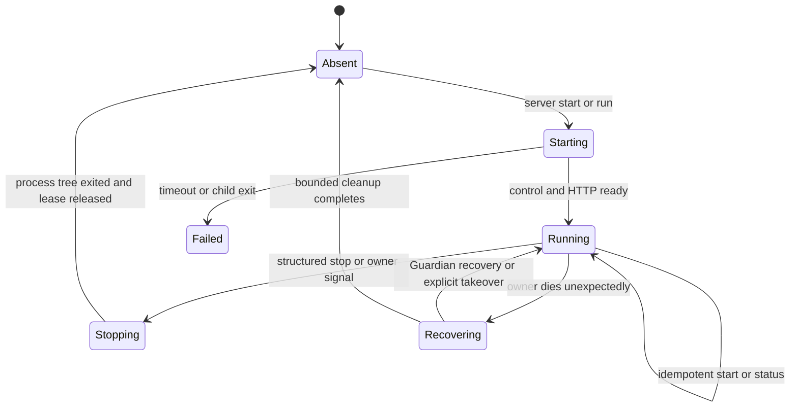

# Remote Runtime and Access

This guide owns OpenAlice's remote Runtime architecture: server lifecycle,
local and remote client responsibilities, SSH transport, managed remote
bootstrap, control/status contracts, multi-client authority, and the staged
path toward an independent Studio frontend.

Start with [[docs/remote-quickstart.md]] for the user-facing setup and daily
workflow. This owner guide complements [[docs/local-runtime.md]],
[[docs/docker-deployment.md]], and [[docs/managed-workspace-runtime.md]]. The
Herdr comparison that informed this design is recorded in
[[docs/reference/herdr-remote-architecture.md]]. That reference is research;
this guide is the OpenAlice contract.

## Status

The repository now contains the source-backed Stage 0 through Stage 2 path:

- `openalice start` prepares a source checkout, runs Guardian in the
  foreground, and optionally opens the local browser;
- `openalice ssh <target>` creates a loopback SSH tunnel to an already-running
  remote OpenAlice Runtime;
- `openalice server run|start|status|stop` provides a browserless foreground or
  detached Runtime lifecycle backed by Guardian's local control endpoint;
- `openalice remote <target>` probes, plans, installs the ordinary CLI when
  approved, installs missing Linux source-build tools when the checkout needs
  preparation, starts or reuses the remote Server, and opens the same loopback
  tunnel;
- Electron remains a complete local desktop distribution.

These commands are still source-backed preview behavior on the `dev` lane, not
a standalone headless release. The clean Docker SSH acceptance covers the
management and tunnel loop; real long-latency Agent TUI measurements remain a
separate release observation rather than a reason to invent a new terminal
protocol preemptively.

## Product Decision

OpenAlice has four first-class entry surfaces, not one replacement chain:

| Surface | Presentation runs | Runtime runs | Purpose |
|---|---|---|---|
| Electron | local packaged app | local Electron-owned Runtime | complete desktop distribution |
| Local browser | local browser | local Guardian-owned Runtime | low-friction CLI distribution and development |
| SSH browser | local browser | remote Guardian-owned Runtime | same product over an authenticated transport |
| Independent Studio | local or hosted web client | local, remote, or managed Runtime | later presentation-neutral client |

Electron must remain complete. The CLI/server path is an additional
distribution and remote-control surface; it does not replace Electron's
`app://` protocol, preload/IPC, packaged PTY, signing, updater, or managed
runtime behavior.

The first remote product reuses the normal OpenAlice browser application over
an SSH loopback tunnel. This already keeps the expensive and security-sensitive
work on the remote host while rendering HTML locally. A new hosted Studio
protocol is deferred until the local/server boundary is stable.

## Vocabulary

- **Runtime**: the Guardian-owned process tree and user state under one
  `OPENALICE_HOME`. It includes Alice, optional UTA, optional Connector Service,
  workspaces, PTYs, native Agent CLIs, schedules, and file-backed state.
- **Server**: a Runtime deliberately started without owning a browser or
  terminal client. It continues after the command that requested detached
  startup exits.
- **Client**: a presentation or control surface: browser, Electron renderer,
  installed CLI, or future independent Studio.
- **Transport**: how a client reaches a Runtime. The first remote transport is
  OpenSSH; it is not part of Runtime state.
- **Control endpoint**: a user-local, non-network endpoint owned by Guardian for
  status and graceful shutdown. It is distinct from Alice HTTP, MCP/CLI, UTA,
  Connector, and PTY WebSocket endpoints.
- **Presentation protocol**: HTTP/WS for the current browser, Electron IPC for
  the packaged app, and a future versioned snapshot/event protocol for an
  independent Studio.

## Architectural Invariants

1. The machine that owns the files owns the Workspace, native Agent processes,
   tool execution, provider requests, and trading boundary.
2. Guardian remains the final single-writer and process-tree authority for an
   `OPENALICE_HOME`; a new CLI command may not invent a parallel lock.
3. UTA remains optional. Server, remote status, browser Chat, and non-trading
   work must function in lite/read-only mode.
4. Alice binds to `127.0.0.1` for local and SSH-backed server use. Internal
   MCP/CLI, UTA, Connector, control, and PTY ports are never made public to
   enable remote access.
5. SSH authenticates and encrypts transport. It does not silently grant
   install, update, start, takeover, or stop consent.
6. Disconnecting a browser, Electron renderer, CLI, or SSH tunnel does not stop
   a detached Server.
7. `server stop` asks the owning Guardian to terminate its own tree and verifies
   completion. It does not signal a guessed PID or delete a live lock.
8. `--takeover` remains the only command-line authority to replace another
   recorded Guardian owner.
9. Remote bootstrap reuses the invoking local CLI's recorded ordinary
   installer source and selector. It does not carry a second SSH-only installer
   or upload the full OpenAlice Runtime through SSH.
10. Shared Runtime facts use presentation-neutral names and versioned schemas.
    Browser layout, Electron chrome, modal state, and other client UI state do
    not become server truth.

## Layered Topology

```text
presentation plane
  browser | Electron | future Studio
        │
transport plane
  loopback HTTP/WS | Electron IPC | SSH loopback | future capability channel
        │
runtime/control plane
  Guardian lease + local control endpoint + Alice APIs
        │
execution plane
  Workspace files + PTYs + native Agent CLIs + tools + optional UTA
```

The boundary matters when debugging latency. In an SSH-browser session, the
browser is local but the shell/TUI and model loop are remote. Keystrokes cross
the network to the remote PTY; remote screen changes return over the Workspace
WebSocket. HTML layout, menus, lists, and most Studio interaction remain local
browser work.

## Command Contract

### Existing local and transport commands

```bash
openalice start [app-dir]
openalice ssh <target>
```

`openalice start` is an interactive foreground convenience command. It prepares
the source checkout, starts Guardian, opens the browser unless `--no-open` is
set, and stops its Runtime when the command receives a termination signal. If a
healthy Runtime already owns the requested home and port, it reuses that URL
instead of replacing the owner.

`openalice ssh` is a pure transport command. It chooses a free local loopback
port, forwards it to the remote Alice loopback port, optionally opens the
browser, and stays in the foreground to own the tunnel. It never installs,
updates, starts, stops, or takes over the remote Runtime.

### Server lifecycle

```bash
openalice server run [app-dir]
openalice server start [app-dir]
openalice server status
openalice server stop
```

All server commands accept the same explicit `--home`, `--port`, and source
checkout selection as local start. `run` and `start` also accept `--rebuild` and
`--takeover` where the existing start contract does.

| Command | Lifetime and side effects |
|---|---|
| `server run` | foreground Guardian; no browser; logs remain attached; signals cascade through Guardian |
| `server start` | idempotent detached start; waits for control and HTTP readiness before succeeding; never opens a browser |
| `server status` | read-only probe; human output by default and stable `--json` for orchestration |
| `server stop` | structured local stop request to the matching CLI Server, followed by a bounded wait for tree and endpoint exit |

`server start` has three valid outcomes:

1. **started**: it prepared the Runtime, detached it, and observed readiness;
2. **already running**: the requested CLI Server was already healthy and
   compatible, so no process was replaced;
3. **owned elsewhere**: another launcher or incompatible owner holds the
   Guardian lease. The command reports the owner and exits without mutation.

Only an explicit `--takeover` may turn the third result into replacement. A
normal start must never interrupt an Electron session, another checkout, a
Docker-owned home, or a healthy CLI foreground start.

`server stop` is deliberately narrower than takeover. It stops a Runtime only
when the reachable control endpoint proves that it is the requested CLI Server
for the same canonical home. If Electron or another launcher owns the lease but
does not advertise that control contract, status reports `owned_elsewhere` and
stop refuses. The user may then close that surface normally or make a separate
explicit takeover decision.

### Managed remote command

```bash
openalice remote <target> --app-dir <remote-checkout>
```

`openalice remote` is orchestration around the same Server and SSH contracts:

1. verify ordinary SSH connectivity and host-key policy;
2. detect remote platform and an installed `openalice` CLI;
3. probe `openalice server status --json` and protocol compatibility;
4. compare the remote CLI version and recorded installer source/selector with
   the invoking local CLI;
5. if CLI install or update is required, show the exact matching plan and ask
   separately before calling the normal installer on the remote host;
6. re-probe and re-plan after installation so a newly visible owner can block
   or require a second explicit takeover decision;
7. run `openalice server start --app-dir ...` remotely and wait for readiness;
8. create the same loopback tunnel used by `openalice ssh`;
9. reuse the last successful local port for this target and remote home when it
   is available, so an existing browser tab can reconnect to the same origin;
10. open or print the local URL and stay in the foreground to own only the
    tunnel.

When reusing a healthy Server, `remote` takes the loopback web port from the
versioned status response. An explicitly supplied `--remote-port` must match
that owner; a mismatch is reported before opening a misleading tunnel.

Closing `openalice remote` closes the tunnel but leaves the detached remote
Server running. Stop is explicit:

```bash
ssh <target> '"$HOME/.openalice/bin/openalice" server stop'
```

A later convenience subcommand may issue that same remote command, but it must
not conflate “disconnect” with “stop my remote work.”

The source-backed phase requires `--app-dir` unless the remote CLI already has
a previously validated Runtime source or standalone bundle recorded for that
home. It must not scan arbitrary remote directories or clone a repository
without a separate visible plan. A future headless release bundle can remove
the source-checkout requirement without changing the command or lifecycle
contract.

`--yes` may approve the displayed install/update/start plan for automation, but
it never implies `--takeover`. Non-interactive execution without a sufficient
explicit approval fails without remote mutation.

The remembered local port is user-local connection state, not remote Runtime
state. An explicit `--local-port` wins. If an automatically remembered port is
already occupied, `remote` reports the conflict, allocates a free loopback port,
and remembers the replacement only after the tunnel passes OpenAlice readiness.

## Server Lifecycle



The readiness barrier includes:

- Guardian owns the canonical runtime lease;
- the local control endpoint responds with a compatible protocol;
- Alice reports healthy on its loopback HTTP endpoint;
- optional components report their own state without making UTA a readiness
  requirement for non-trading use.

The detached parent returns success only after this barrier. On timeout it
prints the isolated log path and current ownership evidence. It must not report
success merely because a child PID was spawned.

The Server appends Guardian and child output beneath the selected
`OPENALICE_HOME` and prints that path on start. Logs must not contain provider,
broker, SSH, pairing, or sealing secrets.

## Guardian Control Contract

### Endpoint

The Unix endpoint is normally
`<OPENALICE_HOME>/state/guardian-control.sock`, mode `0600`. If that path would
exceed the conservative Unix-domain-socket byte limit, both Guardian and the
CLI derive a per-home hashed filename beneath a UID-owned `0700` directory in
the OS temporary root. Native Windows derives an equivalent per-home named
pipe. Every form is deterministic for the canonical home and is removed only
when the closing Guardian still sees the socket identity it created.

The endpoint is never bound to TCP and is never forwarded by `openalice ssh`.
Remote orchestration reaches it only by executing the remote CLI through SSH.

Stale path handling follows reachability and ownership, not existence alone:

1. connect and perform a versioned status request;
2. if reachable, treat it as an owner regardless of a surprising PID file;
3. if unreachable, consult the Guardian lease/recovery state;
4. remove a stale endpoint only while acquiring ownership for a new Guardian;
5. never unlink an endpoint merely because status timed out once.

### Versioned messages

The control protocol is newline-delimited JSON with a small, bounded request
size. Every request and response carries `protocol` and `id`. Initial methods:

- `runtime.status` — read-only readiness, ownership, version, endpoints, and
  component health;
- `runtime.stop` — acknowledge intent, begin the normal Guardian shutdown
  cascade, and close the endpoint only after shutdown begins.

The status result is presentation-neutral and includes at least:

```json
{
  "protocol": 1,
  "runtimeVersion": "<OpenAlice version or dev identity>",
  "state": "running",
  "home": "<canonical OPENALICE_HOME>",
  "owner": {
    "surface": "cli-server",
    "pid": 1234,
    "instanceId": "<Guardian instance id>",
    "startedAt": "<ISO-8601>",
    "launchRoot": "<source or bundle root>"
  },
  "endpoints": {
    "web": "http://127.0.0.1:47331"
  },
  "components": {
    "alice": "ready",
    "uta": "disabled",
    "connector": "disabled"
  },
  "capabilities": ["runtime.stop"]
}
```

Human `server status` output may be friendly, but `--json` preserves this
machine-readable meaning and stable exit classes:

| Class | Meaning |
|---|---|
| `running` | compatible CLI Server is ready |
| `starting` / `stopping` | matching owner is in a transitional state |
| `absent` | no reachable control endpoint and no live Guardian owner |
| `owned_elsewhere` | Guardian evidence exists, but it is not a matching controllable CLI Server |
| `incompatible` | endpoint is reachable but protocol/runtime compatibility fails |
| `unhealthy` | matching owner exists but readiness checks fail |

Status must not return credentials, auth tokens, complete environment
variables, arbitrary command lines, or private internal-port URLs.

### Shutdown and recovery

`runtime.stop` enters the existing Guardian shutdown path:

1. stop accepting new control mutations;
2. send the normal graceful signal to children;
3. wait the existing grace period;
4. escalate through Guardian's process-tree policy when required;
5. wait for children and the recorded owner to exit;
6. release only the lease and control endpoint owned by this instance.

If the control endpoint is unreachable but a lease exists, `server stop` does
not improvise cleanup. Recovery remains the existing explicit Guardian
takeover path with its discover → TERM → grace → tree KILL → owner-exit order.

## SSH Transport Contract

The current transport remains intentionally boring:

```text
local browser
  └── http://127.0.0.1:<random-local-port>
        └── ssh -L 127.0.0.1:<local>:127.0.0.1:<remote>
              └── remote Alice HTTP + Workspace PTY WebSocket
```

Alice, the Workspace, Agent CLI, shell, provider calls, and tools run on the SSH
host. The browser loads the normal OpenAlice bundle through the tunnel, so
HTTP, authentication, and Workspace WebSockets stay on one local loopback
origin. No public domain, hosted-cookie bridge, relay, or second frontend
protocol is required.

`openalice ssh` and the tunnel phase of `openalice remote`:

- bind only local `127.0.0.1`;
- target only remote `127.0.0.1`;
- use the user's ordinary OpenSSH config, agent, keys, ProxyJump, and host-key
  verification;
- preserve interactive SSH authentication when a terminal is available;
- use keepalives without overriding stronger user config;
- exit clearly when the local port cannot bind or the remote forward fails;
- for managed `openalice remote`, prefer the last successful per-target local
  port so the old browser origin can recover after a tunnel reconnect, and
  visibly fall back when that port is occupied;
- never disable host-key checking;
- never expose the Guardian control endpoint.

Before diagnosing an OpenAlice error, users should be able to verify
`ssh <target>` independently. Managed remote may reuse an SSH ControlMaster in
a private user-only temporary directory, but it must clean up only the control
socket it created.

## HTTP and Browser Security

SSH makes the remote HTTP request arrive from loopback, so network origin alone
is not sufficient authorization. The browser contract remains:

- the UI, HTTP API, and PTY WebSocket share the tunnel's local loopback origin;
- Alice accepts loginless local behavior only for no-`Origin` local CLI/server
  callers, a validated loopback browser origin, or the exact packaged
  `app://openalice` origin;
- public web origins cannot inherit localhost trust merely because a tunnel is
  open;
- state-changing requests and WebSocket upgrades keep origin validation;
- `OPENALICE_DISABLE_AUTH=1` is never a remote-access instruction;
- a deployment intentionally exposed beyond loopback follows
  [[docs/docker-deployment.md]] and its normal HTTPS/auth boundary.

The future independent Studio cannot reuse “it arrived from loopback” as its
identity. It needs an explicit pairing/capability flow with revocation,
least-privilege scopes, origin binding, and a user-visible device/session list.
That is a later protocol, not a shortcut in the SSH phase.

## Terminal and Agent Streaming

### Stage-one behavior

The existing Workspace PTY WebSocket crosses the SSH tunnel unchanged. The
remote PTY and Agent TUI remain authoritative; the local xterm-compatible
surface renders received terminal bytes. Shell, Claude Code, Codex, opencode,
and Pi retain the same terminal semantics. WebPi remains an optional structured
Pi surface, not a prerequisite or replacement for shell/TUI workflows.

This path should be measured before adding a second terminal protocol. Relevant
tests use controlled network conditions such as 20 ms, 80 ms, and 150 ms RTT,
low-bandwidth links, bursty Agent redraws, resize, reconnect, and long-running
output. Record:

- input-to-first-visible-output latency;
- bytes transferred during representative Agent interactions;
- whether stale output accumulates after a burst;
- reconnect and scrollback behavior;
- CPU and memory on both ends;
- behavior when the tunnel disappears mid-command.

Round-trip latency cannot be removed while the Agent process is remote. The
design goal is to avoid adding avoidable backlog, excessive redraw bandwidth,
or remote presentation work on top of that RTT.

### Structured terminal optimization, if evidence requires it

If raw PTY traffic creates meaningful backlog or bandwidth cost, add a
terminal-specific stream behind stable Workspace/Session/terminal identities:

- server parses terminal bytes into current VT state;
- clients negotiate full snapshot plus incremental updates;
- each frame has a monotonic sequence and explicit dimensions;
- control messages remain reliable and ordered;
- render updates are bounded latest-state data, not an unbounded reliable
  queue;
- a gap or incompatible baseline triggers a fresh snapshot;
- only an acknowledged or queued frame advances the per-client baseline;
- observers cannot send input or resize;
- one controller owns input and resize, with explicit takeover.

This stream optimizes terminals only. Studio navigation, data tables, settings,
Inbox, Workspace metadata, and trading UI continue to use presentation-neutral
application APIs rather than a remote-rendered framebuffer.

## Multi-Client Authority

The first SSH-browser release may support one interactive browser per terminal,
but the contract reserves explicit roles:

| Role | Read output | Send input | Resize PTY | Take ownership |
|---|---:|---:|---:|---:|
| observer | yes | no | no | no |
| controller | yes | yes | yes | no |
| takeover requester | after grant | after grant | after grant | explicit only |

For a given terminal there is at most one controller. A second browser,
Electron client, or future Studio may observe without changing the PTY size.
Control transfer is visible and deliberate; it is not awarded silently to the
last socket that sends a resize.

Client-local effects stay client-local:

- clipboard reads/writes target the controlling local surface;
- notifications name the Session and source client policy;
- window size and focus are not durable Runtime facts;
- reconnect does not imply takeover;
- disconnect releases transient controller ownership after a bounded grace
  period, but does not kill the PTY or Agent.

Shared Runtime facts include Workspace and Session identity, terminal identity,
Agent process/session metadata, execution status, artifacts, and file-backed
state. They must not be named after a particular sidebar, card, tab strip, or
Electron window.

## Persistence Semantics

Remote documentation must distinguish what survived:

| Event | Guardian tree | PTY process | recent terminal state | Agent conversation |
|---|---:|---:|---:|---:|
| browser/tunnel disconnect | survives | survives | live in PTY Runtime | survives because process lives |
| controller transfer | survives | survives | live in PTY Runtime | survives because process lives |
| Alice child restart under Guardian | Guardian survives | depends on current PTY ownership path | implementation-dependent | native Agent process/session dependent |
| full Guardian/server restart | stops and restarts | does not automatically survive | only persisted history, if explicitly supported | only through native Agent resume/provenance |
| machine reboot | stops | stops | only persisted history | only through native Agent resume/provenance |

OpenAlice must not market server detach as crash-proof terminal persistence.
Conversation provenance and native CLI resume remain governed by
[[docs/conversation-provenance.md]]. Persisting terminal scrollback is a
separate privacy decision because screens can contain source, prompts, output,
tokens, or account data.

Live PTY handoff during Runtime upgrade is explicitly deferred. The first
managed remote version may require a visible stop/restart when protocols are
incompatible. It must describe the effect before acting.

## Managed Remote Bootstrap and Compatibility

Managed bootstrap uses a plan/apply split.

The read-only plan reports:

- SSH target and resolved remote platform/architecture;
- detected OpenAlice CLI path, version, and whether its version/install source
  match the invoking local CLI;
- control protocol compatibility;
- Server state and source/bundle root;
- whether the selected source checkout already has complete Runtime artifacts;
- missing Git, Python 3, make, or C++ tools and the package-manager action that
  would provide them;
- proposed install/update/start actions;
- destination paths and whether PATH changes are required;
- whether a running owner would be affected;
- the final local and remote loopback ports.

Apply rules:

1. no matching compatible CLI: ask before invoking the normal installer with
   the local CLI's recorded branch/tag/commit selector;
2. source artifacts absent and Linux build tools missing: include
   `--with-runtime-deps` in that same normal installer invocation after plan
   consent;
3. complete source artifacts: do not modify system packages merely because a
   compiler is absent;
4. compatible CLI, absent Server: start after explicit plan consent;
5. compatible healthy Server: reuse without mutation;
6. incompatible stopped CLI: ask before update;
7. incompatible running Server: stop/restart or update only after a second
   effect-specific confirmation;
8. owner conflict: fail unless the user separately passed `--takeover`;
9. non-interactive mode: require flags that cover every proposed mutation.

Remote SSH commands retry a small allowlist of transport failures (connection
reset/timeout/close, key-verifier service interruption, and SSH identification
exchange failures). Arbitrary remote command failures are never retried. After
an approved installer or Server-start action loses its SSH transport, managed
remote re-probes the versioned state: it continues only when the intended CLI
or Server is already present and compatible, otherwise it returns the original
failure. Source preparation uses compact phase output and suppresses successful
package/build chatter; a failed phase still includes a bounded diagnostic tail.

The local orchestrator compares protocol ranges, CLI version, and install
source; human version strings alone are insufficient. It may tolerate a newer
compatible Runtime, but its remote control CLI must match the invoking local
CLI. The managed command exposes no independent branch/version selector. Test
fixtures may replace the installer URL and payload base through test-only
environment seams; those are not a release path.

## Future Independent Studio Protocol

The independent frontend is not “serve the current bundle from another domain
and forward cookies.” It is a client of a versioned Runtime protocol.

Its minimum reconnect model is:

1. authenticate through an explicit local pairing or remote capability;
2. negotiate protocol version and capabilities;
3. fetch one coherent Runtime snapshot with a cursor;
4. subscribe to ordered events after that cursor;
5. attach specialized streams, such as terminal output, by stable identity;
6. if the cursor is unavailable or a sequence gap appears, discard derived
   state and resnapshot;
7. issue mutations with request IDs and idempotency where retry is possible.

The snapshot contains presentation-neutral data such as Runtime identity,
Workspace/Session records, terminal and Agent identities, health, and
capabilities. It does not contain browser component trees or Electron window
state.

This protocol can later travel through SSH stdio, a local socket, an
authenticated WebSocket, or a relay. Transport choice does not redefine the
Runtime model.

## Delivery Stages

### Stage 0 — pure SSH tunnel (implemented)

- remote Runtime is started manually;
- `openalice ssh` owns only the tunnel;
- normal browser UI and PTY WebSocket traverse one local loopback origin;
- no remote mutation.

### Stage 1 — native Server lifecycle (implemented)

- `server run/start/status/stop`;
- Guardian-owned local status/stop endpoint;
- detached start waits for real readiness;
- status distinguishes absent, compatible, unhealthy, and other owner;
- stop is structured and self-owned;
- Electron behavior remains unchanged.

### Stage 2 — managed source-backed remote (implemented baseline)

- `openalice remote` plan/apply orchestration;
- probe and bootstrap the existing CLI plus pinned managed Pi with explicit
  consent;
- when an older healthy CLI Server lacks managed Pi, infer its recorded source
  root, install Pi, stop that self-owned Server through `runtime.stop`, and
  restart it so the Guardian tree inherits the managed runtime;
- start/reuse the remote Server;
- reuse the existing SSH loopback tunnel;
- leave the Server alive after disconnect;
- remaining release observation: validate ordinary Agent TUI interaction under
  representative network shaping before deciding whether Stage 3 is useful.

#### Railway cold-host observation — 2026-07-15

A disposable Railway Sandbox provided the first real clean-host acceptance for
Stage 2. The host was Debian 13 x86_64 with Node 24, pnpm 11, curl, and Git. A
fresh `dev` checkout did not have Python 3; `node-pty` had no matching bundled
Linux x64 prebuild for that Node version, fell back to `node-gyp`, and made the
old bootstrap fail during `pnpm install`. Installing Python 3, make, and g++
allowed the same source preparation and detached Server start to complete.
This failure is the reason the ordinary installer now owns the explicit Linux
source-build-tool plan.

The subsequent macOS-to-Railway loop verified:

- real SSH plan, default-no confirmation boundary, CLI install, source build,
  detached Server readiness, and local loopback tunnel;
- a Shell Workspace Session accepted `printf 'REMOTE_PTY_OK\\n'`; the result and
  next prompt were visible in the first observation within 500 ms;
- closing the tunnel left the Server and Shell Session alive;
- reconnecting replayed the existing terminal scrollback; current managed
  remote also reuses the last successful local port when it remains available,
  allowing the original browser tab and origin to recover;
- structured `openalice server stop` returned the isolated home to `absent`.

Claude Code, Codex, opencode, and Pi executables were present on that host, but
only Shell completed an end-to-end PTY interaction. A harmless Codex prompt
reached the remote process and failed with missing provider authentication, so
this observation does not claim an authenticated model turn or the full Agent
TUI matrix. No provider credentials were copied into the disposable host.
Representative 20/80/150 ms network shaping also remains unmeasured.

After the bootstrap fix, a second fresh Sandbox repeated the same cold-host
shape with Python 3 absent. The managed plan reported only that missing tool,
one outer confirmation authorized the normal installer, and the installer
installed the declared Linux package set without a manual `apt` command.
Python 3.13.5 was then available; source preparation, detached readiness, the
real `/chat` route, tunnel disconnect, and reconnection on a new local port all
passed. The Server was stopped through its control endpoint before the Sandbox
was destroyed.

A 2026-07-15 Railway regression run then exercised the hardened reconnect path
against another fresh Sandbox. Successful source preparation printed only the
install/build phases; two naturally occurring Railway SSH interruptions
(`Connection closed` followed by the temporary key-verifier outage) were
retried and recovered without repeating a completed mutation. Three tunnel
connections all selected the same remembered local port. A browser tab left
open across the final disconnect first showed its normal fetch failure, then
recovered in place after the tunnel returned on the same origin. The Server was
stopped through its control endpoint and the Sandbox was destroyed.

A later user-facing Railway Sandbox completed the missing authenticated Agent
loop. Pi `0.80.6` was installed on the live remote host, OpenAlice selected Pi
as the Workspace default, injected a sealed LongCat-compatible provider
credential through the normal AI Provider flow, and started a trusted Pi TUI
without the project-trust deadlock. The prompt `请只回复：远程 OpenAlice Pi
已经工作` returned exactly `远程 OpenAlice Pi 已经工作` through the macOS
browser, SSH tunnel, remote PTY, remote Pi process, and provider round trip.
This validates the functional Pi path; representative 20/80/150 ms network
shaping remains a separate latency observation.

A 2026-07-16 persistent-volume Railway service then exercised the stable
`master` installer through ordinary OpenSSH. Cold bootstrap, source build,
detached readiness, tunnel HTTP/auth, disconnect persistence, idempotent plan,
and same-container restart recovery all passed. A full Railway redeploy kept
the checkout, build artifacts, and `OPENALICE_HOME` on the volume while
correctly dropping the container-local CLI and Pi, which managed remote then
reinstalled from `https://openalice.ai/install` without rebuilding the source
Runtime.

The redeploy also confirmed the cross-machine safety boundary. The reattached
volume still named the removed container as Guardian and Alice owner; ordinary
start refused it, and explicit `--takeover` still refused to signal or reclaim
an owner from another machine. After Railway independently reported the old
deployment as removed, the operator quarantined all three foreign lock records
before starting the new owner. This is an operational recovery observation,
not automatic cross-machine failover: heartbeat expiry alone must never grant
permission to reclaim a shared volume.

### Stage 3 — terminal transport optimization

- build only if Stage 2 measurements justify it;
- add snapshot/diff/sequence/backpressure semantics for terminal state;
- add controller/observer ownership and takeover tests;
- keep the rest of Studio on application-level APIs.

### Stage 4 — independent Studio and broader transports

- add Runtime snapshot/events protocol;
- add pairing/capability security;
- support Electron remote selection and/or hosted Studio;
- consider relay/device enrollment only after direct SSH is operationally
  understood.

### Stage 5 — standalone headless Runtime bundle

- replace source checkout preparation with signed, content-addressed release
  assets where supported;
- retain the same `server` and `remote` commands, status schema, state root, and
  consent model;
- keep source-backed development as a supported diagnostic path.

## Acceptance Matrix

### Stage 1

| Scenario | Required result |
|---|---|
| fresh isolated home | detached Server reaches control and HTTP readiness |
| second normal start | reports already running; does not signal owner |
| explicit takeover | follows Guardian recovery ordering and obtains one owner |
| status JSON | stable schema and exit class for all lifecycle states |
| graceful stop | Guardian stops children, releases owned lease/socket, exits in bound |
| hung child | TERM precedes process-tree KILL; no orphan survives |
| stale endpoint | recovered only with lease/ownership evidence |
| cross-root or foreign owner | no normal-start kill; explicit takeover only |
| optional UTA absent | Server and browser Chat remain ready |
| Electron running | `server start/stop` do not silently replace or terminate it |
| packaged Electron smoke | local app, PTY, IPC, and shutdown remain healthy |

### Stage 2

| Scenario | Required result |
|---|---|
| matching compatible remote CLI/Server | reuses both without mutation |
| protocol-compatible CLI from a different branch/tag/commit | plan names a matching CLI update before connection |
| compatible CLI Server but managed Pi missing | plan names Pi install and self-owned Server restart; refreshed Server reports pinned Pi |
| missing remote CLI, interactive | shows plan; default no leaves host unchanged |
| missing remote CLI, non-interactive | fails unless explicit approval is present |
| incompatible running Server | explains process impact before update/restart |
| remote source missing | fails with actionable `--app-dir` guidance; no surprise clone |
| source artifacts missing, build tools missing | plan names the tools and normal installer command; default no leaves packages untouched |
| source artifacts complete, compiler missing | reuse artifacts without an unnecessary package-manager mutation |
| tunnel disconnect | local command exits; remote Server and work continue |
| reconnect | same local port is preferred; same Runtime, browser origin, and live terminal are reachable; a busy port falls back visibly |
| transient SSH loss after apply | retry known transport faults; re-probe completed install/start state before deciding failure |
| host-key failure | fails without disabling verification |
| SSH agent/passphrase path | preserves normal OpenSSH interaction |
| browser security | same-origin HTTP/WS works; public Origin remains rejected |
| Agent TUI matrix | Shell, Claude Code, Codex, opencode, and Pi remain usable |
| Docker SSH fixture | clean host exercises plan, consent, start, tunnel, reconnect, stop |

### Later protocols

| Scenario | Required result |
|---|---|
| slow observer | cannot accumulate unbounded obsolete terminal frames |
| concurrent clients | exactly one controller owns input/resize |
| dropped sequence | client resnapshots instead of rendering corrupted state |
| reconnect after event gap | Runtime snapshot reestablishes coherent state |
| capability revocation | independent Studio loses access without stopping Runtime |

## Verification Route

When this surface changes:

1. use isolated `OPENALICE_HOME` roots; never exercise recovery against the
   user's normal home;
2. follow [[docs/cli-installer.md]] for distributed CLI payload changes and run
   `pnpm test:install:docker`, plus the manual installer playground before a
   release;
3. run the Guardian recovery case matrix when lifecycle, ownership, signals,
   locks, or the control endpoint changes;
4. start the real localhost route and verify the Workspace terminal and
   loginless loopback Origin contract;
5. exercise pure `ssh` and managed `remote` against a disposable SSH/Docker
   host with `pnpm test:remote:docker`, including default-no, installed payload
   equality, detach persistence, reconnect, and structured stop;
6. follow [[docs/docker-deployment.md]] and run `pnpm docker:smoke` when
   `scripts/guardian/prod.mjs` or the server image path changes;
7. follow [[docs/managed-workspace-runtime.md]] and run the matching Electron
   and package smoke whenever shared Guardian, PTY, startup, or dependency
   behavior changes;
8. run the repository-wide TypeScript and test gates required by `AGENTS.md`.

Record any network-shaping gap explicitly. A localhost smoke does not verify
remote TUI behavior, and an SSH tunnel smoke does not verify Electron package
behavior.

## Non-Goals for the First Implementation

- public TCP binding of Alice or the Guardian control endpoint;
- hosted-domain cookie forwarding;
- cloud relay, NAT traversal, or device fleet management;
- live migration of PTYs across Runtime upgrades;
- persistent terminal screen history by default;
- simultaneous writable control from multiple clients;
- replacing Electron with a browser wrapper;
- replacing Shell or native Agent TUIs with Pi/WebPi;
- silently cloning OpenAlice or installing optional additional Agent CLIs on a
  remote host; pinned managed Pi is part of the visible baseline plan;
- moving broker credentials, account state, or trading writes out of UTA.
